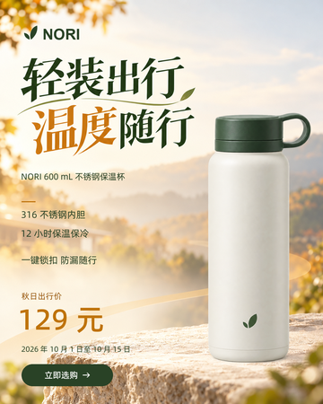

# 电商主视觉迭代图片索引

本索引对应[最新迭代总结](hero-skill-iteration-summary.md)，包含正文示例与2026-10-05补充图片。早期图使用已有归档预览，较新图为原件副本；发布过程不裁切、重绘或重编码。完整历史图库、原件ZIP和版本备份保留本地。

同内容按SHA-256去重，正文可多次引用同一图。图片分类描述在总结中的用途，不表示都曾作为生成工具输入。成片来源和skill效果判断以总结中的制作记录与验证边界为准。

[图片机器清单](assets/hero-iterations/manifest.json)

## figure-01

用户提供：最初不使用 skill 的鞋海报

尺寸：1122×1402；SHA-256：`cd4a9c743ec323c586346c931443463e1fb63513f76aa6f6284518e1130961f2`。

## figure-02

用户提供：最初使用 skill 的鞋海报

尺寸：1200×1500；SHA-256：`e66a4f01a1e4daa1d4283625024f7c4622bb993177688160b69b59ad8c62b139`。

## figure-03

用户指出的相机手持图：人物裁切与机位逻辑不自然

尺寸：1121×1403；SHA-256：`a81c5c8d39ab0515bd3c093328e6ec8e109164a27ce915dfb2c2051fad3fcb4a`。

## figure-04

吹风机：v4 文字优化阶段

尺寸：1200×1500；SHA-256：`d136cf67f64b700c285c7414ca463cfb42c9c219fd70aeabeb2c6456425639e1`。

## figure-05

玫瑰花：v4 文字优化阶段

尺寸：1200×1500；SHA-256：`71f60724d8c8b386cf911d2bb679010605c4086318c0e7fcf8f96267765ab155`。

## figure-06

失败证据：无图库玫瑰花图引入了未确认花柄/花瓶关系

尺寸：1200×1500；SHA-256：`d79e640cefeba1b9983396f741bbc61823c4da6bac84e561a2b6bc712d791c5a`。

## figure-07

结构约束后的玫瑰花试跑；装饰又显得过于收敛

尺寸：1200×1500；SHA-256：`328e3ed79aeeb44492c216303cbd15685dbfa56e6c3c80a17eccf2db8b8717a2`。

## figure-08

用户标红：需要解释和反思的局部细线

尺寸：416×337；SHA-256：`331c08a3eb8345a366bf0e91e48458c0f5785f73342aaa55f7ff92119badea97`。

## figure-09

用户标蓝：可以接受的围合与构图关系

尺寸：616×431；SHA-256：`95feb9e8e4ec94526157294504da9ce8144cdeeb1f77351ada641ca8258fa365`。

## figure-10

重新允许氛围装饰后的玫瑰花试跑

尺寸：1200×1500；SHA-256：`c2dee99ced2a217b68f63627c91cfeaf47d336cffdc7829030b1a33792c83e49`。

## figure-11

用户认可的相机文字与框角组合

尺寸：1122×1402；SHA-256：`f01b940c93653060fbe53edc35cdc074657d1859b9b6ed3ddf5570bddac6775b`。

## figure-12

统一规则后的新构思相机试跑；随后收到标题占比过大的反馈

尺寸：1200×1500；SHA-256：`038594059fe723b5b10b265adffb7a414b507ad25116c302ddf54b079eb4a36f`。

## figure-13

咖啡机：当时阶段定稿 skill 试跑

尺寸：1200×1500；SHA-256：`00467890228572345b8d7b8f5fda9287e045e50eabbf297c26e186f4517ed727`。

## figure-14

咖啡机：不使用 skill，另行构思

尺寸：1200×1500；SHA-256：`f7931ac241ca4dfbf21eb49334d66ad7ff36a78bc945ac4904f3c1e997708c3e`。

## figure-15

壁灯：当时阶段定稿 skill 试跑

尺寸：1200×1500；SHA-256：`937dab02e2e0b7c6e8595c0dea16d337d9f729e34c39d854d347045f12243140`。

## figure-16

壁灯：不使用 skill，另行构思

尺寸：1200×1500；SHA-256：`1b4f584faf76720f37066111ae102235eb85fc53c14ed466f39a8a5a57c0b633`。

## figure-17

用户提供的比较图一：花头平铺，标题较统一

用户提供的玫瑰比较图一；不凭外观判断是否使用 skill

尺寸：1122×1402；SHA-256：`a5ca3e3576e8d41685f0ce664dca05f0d2ccd378fca32a2488c3ae3571c41cc7`。

## figure-18

用户提供的比较图二：花瓶与赠礼布景；审美判断不能豁免展示约束

用户提供的玫瑰比较图二；用于讨论审美与结构要求的分别验收

尺寸：1122×1402；SHA-256：`9042293f63017ca4298258a4d816832c20df8d60ae576aba5a83cbaa9f2afb53`。

## figure-19

用户认可的文字自由度示例：词组强调与曲线共同构图

用户认为文字更有美感的示例；价格与结构不作新商品事实依据

尺寸：1122×1402；SHA-256：`4baa4df618f74b46a3c6a7b9be1d9335a0424e4a65208e4bfb0b6f6b6b08f3cb`。

## figure-20

用户相机图：多处亮闪与强化纹理竞争

尺寸：1122×1402；SHA-256：`f48d180b24522c932b7a822be80182e5bd845006a303241eff598c42daaae967`。

## figure-21

用户玫瑰花图：商品与布景效果叠加

尺寸：1122×1402；SHA-256：`c0c30aa437eafa5090a7a0a0c7d9af5b8accef09c666ba1f241cc44a4f0b51c2`。

## figure-22

诊断依据：用户提供的新版相机成片

尺寸：1122×1402；SHA-256：`e3768128a92701d0a3828024d67d55f13efde37f8f234b46fb15c7a5c9b24ee1`。

## figure-23

约束恢复的反馈依据：玫瑰再次插瓶，文字与装饰偏平

用户反馈插瓶与文字装饰趋于平庸；实际生成指令未提供

尺寸：1122×1402；SHA-256：`ab9212c1319048e9ca83199aa99c73d58dddd3c34b2a62d1fb2fa99e1cfad918`。

## figure-24

NORI案例原商品：提供身份、形状、颜色和Logo依据

NORI 案例原商品身份素材

尺寸：1122×1402；SHA-256：`c6fa2920edf11303daed9d073c6622d4d1b7067c6ba242fc7cfa8b34fcdcd693`。

## figure-25

实际背景与中文标题输出：商品区域为空

实际生成的背景与中文标题；提示词明确排除杯体

尺寸：1122×1402；SHA-256：`f2c2347ef22c75dd8ccf78f5511810c162a2902fc61c65828ac3bcdfaa649599`。

## figure-26

NORI已有中文成片：原商品图层合成后的导出

实际原商品图层合成后的中文导出；不是路径修正后的新试跑

尺寸：1200×1500；SHA-256：`1800b5fd4ec6c5c8eef44d790bbf3ac1a016cb78ca6f1c08963610237263c877`。

## figure-27

NORI已有英文成片：相同合成路径的语言版本

同一路径的英文导出；不是对照实验

尺寸：1200×1500；SHA-256：`da5174424f14aae7ef7df744b057f415ae5aa3be75d088e321d902b193c9df09`。

## figure-28

中文背景的英文标题编辑版；后续用于同一商品合成

尺寸：1122×1402；SHA-256：`8eed9d866be727ac9c9c04751d07c082974f61c65a828e16a37d4d4b8e8064e7`。

## figure-29

既有中文导出的手机预览

尺寸：360×450；SHA-256：`b2e7c44db5ef43c42e3dc98e0a6898aa068a287d0a3a6153491861755ab3cc6f`。

## figure-30

既有英文导出的手机预览

尺寸：360×450；SHA-256：`982272e93c75c40d8719b31971c79098ec9d84b332955c5c5381751630548f35`。

