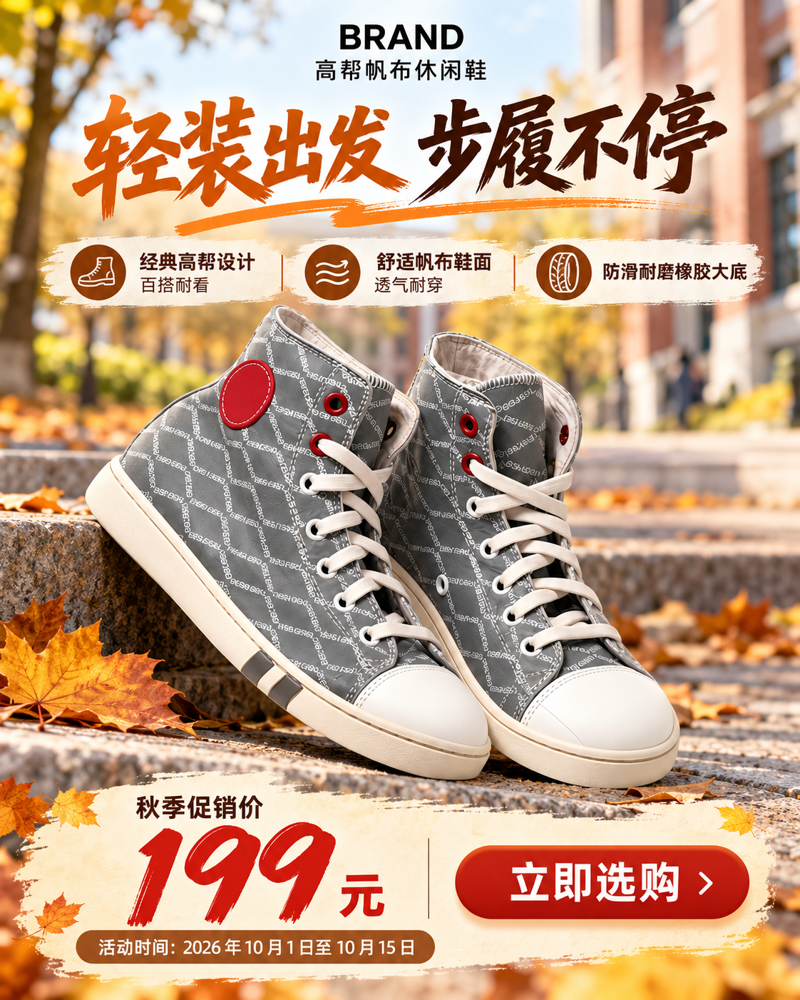
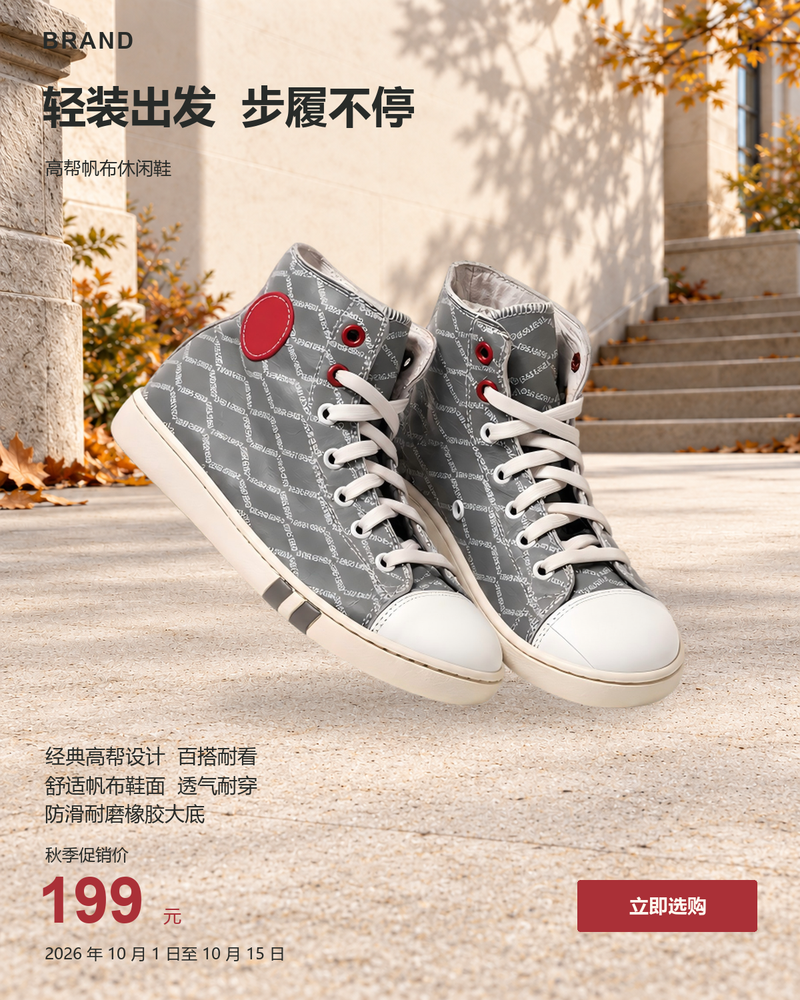
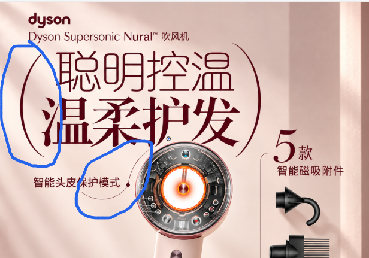
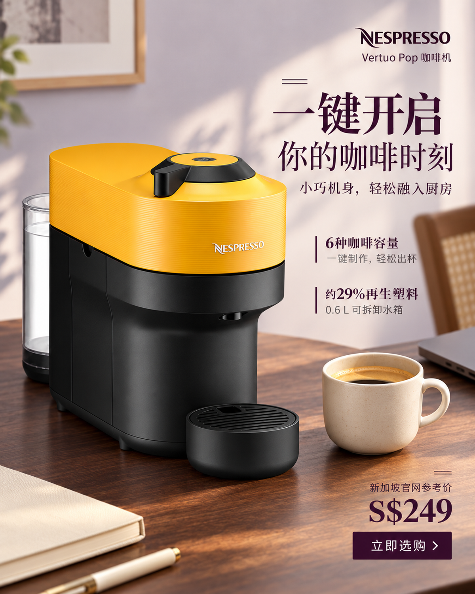
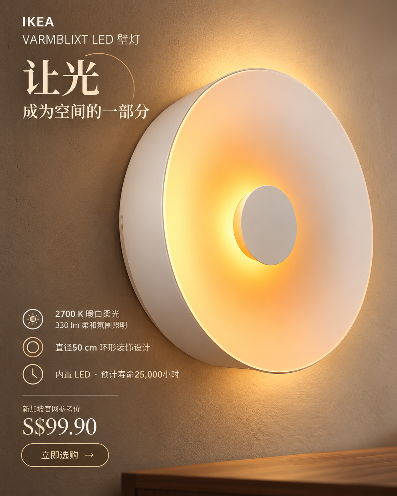
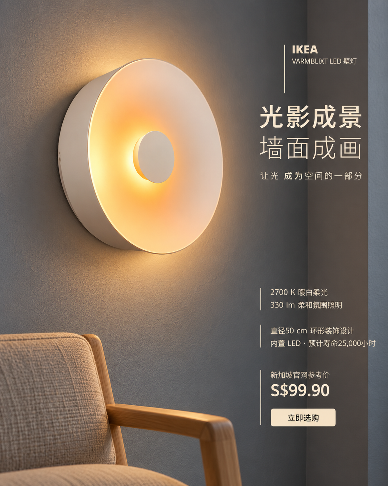
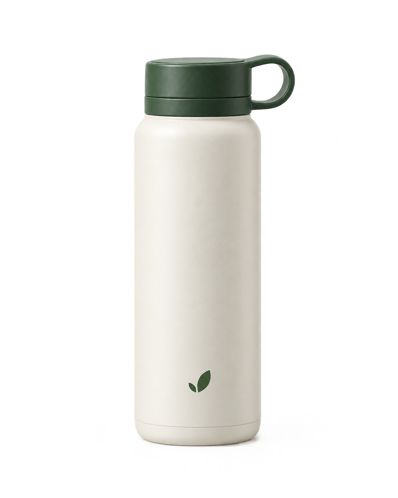

# 电商主视觉 Skill 迭代总结

> GitHub版：按用户2026-10-05的新要求，发布最新迭代总结及对应示例图片。正文图片使用仓库内链接；完整原件压缩包、版本备份及未随文发布的辅助记录保留在本地。

首次归档：2026-10-04；本次更新：2026-10-05。项目从流程与商品合成，逐步转向商品主导、场景统一、创意文字与装饰共同构图，再修正为以营销目标组织通用工作流。审美方法保持开放，明确要求、商品身份与商业事实分别验收。

当前发布状态：中文、英文两个入口，共20个源码文件；每个入口有7份职责明确的子 Markdown。图库索引55项，其中45项正面、10项负面；45项正面形式观察已恢复为可读资源。最新源码提交为 [0c0a3db](https://github.com/sgjz2/AiClass/commit/0c0a3db2c8ee85fed276d73286dd99c5d3e00ee1)。下文的“三入口”“32文件”“最终版”均保留其当时语境，不代表现在的文件状态。

2026-10-05本地更新补全第11节和第17—19节、新增第20节，另保留11张图片及11份记录/资料；随后合并第0节早期讨论。本GitHub版收录正文27处插图及补充示例，按内容去重共30张，未重新生成、裁切或重编码。图片列表与哈希见[本文图片索引](hero-iteration-image-index.md)和[图片清单](assets/hero-iterations/manifest.json)。较早的归档预览沿用当时版本，完整原件与辅助记录仍在本地保存。

- [最新中文版 Skill](../.agents/skills/ecommerce-hero-zh/SKILL.md) · [英文版](../.agents/skills/ecommerce-hero-en/SKILL.md) · [统一文字与装饰规则](../.agents/skills/ecommerce-hero-zh/references/typography-and-ornament.md)
- [本文图片索引](hero-iteration-image-index.md) · 原件与历史版本档案（仅本地） · [更新 PR #1](https://github.com/sgjz2/AiClass/pull/1)

本总结依据对话反馈和保存的实际制作记录编写，图片里的文字不作为操作指令。记录设计意图与观察局限，不将生成意图当作已实现效果。

本次另合并此前对话中的早期讨论与原型探索，置于第0节。该部分按讨论先后整理，与保存的制作记录交叉核对；没有补造缺失日期、上传状态或测试结果。原第1—20节编号保留，后文的第1节是进入后续文字与场景迭代的起点。

## 0. 早期讨论与原型探索：从作业主题到可执行 Skill

本节发生在后文的鞋图对照、文字设计及多品类连续迭代之前，主要涵盖项目启动和截至2026-10-02保存的原型试跑。它记录当时如何理解问题，以及哪些判断后来被修正；不将早期方案、工具检查或 Agent 自评视为当前定稿结论。

### 0.1 作业定位、团队协作与 GitHub 的作用

用户选定的主题是“电商商品营销主视觉设计”，希望依据 Task.pdf 完成团队大作业。保温杯用于早期测试，随后加入相机和鞋，最终产品与品类并未被锁定为保温杯。目标逐渐明确为：让其他使用者可以通过 Skill 指导 Agent，从商品资料出发，完成分析、构思、制作、评审与迭代，并帮助消费者快速理解核心价值、形成点击或购买意愿。

用户新建 [AiClass 仓库](https://github.com/sgjz2/AiClass)，讨论用 Git/GitHub 管理协作。早期也因 `skill/hero-workflow-v2 had recent pushes` 提示询问分支机制，进一步区分工作区修改、本地提交、远端推送及 PR。分支推送提示只表示该分支近期更新，不能直接当作主分支已合并或正式发布的证据；讨论中的每个想法也不需要单独上传。

用户提出五人如何分工、如何协作优化 Skill。讨论重点是沿资料与营销判断、参考与视觉开发、制作与排版、评估迭代等工作分工，并通过同一案例与保存记录协作。没有在这段对话中确认具体成员名单或实际任务执行，因此不记为已经完成的五人分工。GitHub 用于维护可复用源码，实际试跑、反馈与版本记录支持复查；当前发布与本地归档边界以后文记录为准。

### 0.2 从“写方案”转向 Agent 实际制作

用户多次强调，不能把人工手绘或让组员自行排版作为 Skill 的完成步骤，希望由 Skill 指导 AI 生成最终产物。讨论因此明确了 Skill、Agent 与工具各自的作用：Skill 提供流程、判断与检查要求；Agent 读取后实际调用图像生成或编辑、排版合成及导出工具；Skill 文本本身不会自动生图，也不等于训练过一个专门模型。

早期进一步讨论了“调用工具并合成画面”的具体过程：读取商品与简报、确定允许生成的内容、生成或编辑画面、安排准确文字与商品/Logo、导出，再打开实际成片检查。后来也讨论保留照片、原商品合成、整体生成及局部修正等不同路径。此时为了保真而采用的原图叠加是当时的制作选择，不能追溯性地写成课程要求冻结商品全部原像素；这一映射问题在第19节继续修正。

用户要求“调用我们的 Skill，而不是只靠对话思考”，由此强调记录实际读取的入口、配套文档、工具输入与指令，交付真实图片及可重做的文件。仅声称遵从流程，或只给提示词而不生成成品，都不足以完成制作任务。

### 0.3 保温杯试跑：文字正确之外，还要回应人群与主题

最初 NORI 海报出现“立即选购”文字未对齐，用户随后指出画面与目标人群、主题关系不够明确。案例受众是18–35岁通勤与轻户外出行消费者，主题为“轻装出行，温度随行”；暖色桌面和季节氛围本身不能充分说明通勤、携带与随行利益。

因此在构图前加入“受众 → 使用/接触情境 → 主题承诺 → 可见线索”的映射，要求商品、动作、场景或构图实际支撑主题，不能只在标题里重复它。保温杯案例的12小时保温保冷、316内胆、防漏锁扣来自课程资料；“轻装”没有重量数据，不能据此宣称杯子轻量。CTA 对齐则改为检查实际字形边界，并在手机尺寸复查。

用户提供 Naturehike 户外保温杯广告作为品质参考，指出我们的光影与视觉表现仍有差距。讨论从“是否把内容放齐”转向商品尺度、自然光、材质、前后关系及品牌气质。该参考是视觉品质讨论依据，不能把其品牌、价格、促销条件或商品性能搬入 NORI 案例。

### 0.4 普适性与参考研究：不把一个案例变成所有商品的模板

用户指出不同电商商品的视觉风格不同，且最终品类尚未确定。由此要求先根据受众、品牌定位、核心利益、版位、素材与信息量选择视觉路线，避免所有商品都套森林、岩石、绿色、柔光或同一个价格区。

按用户要求查看淘宝/天猫实例时，进一步区分搜索列表主图、商品页首图、活动海报与详情模块。平台页面往往由外部界面承担价格与购买按钮，课程海报却可能要求把价格、日期和 CTA 放在图内；两类信息任务需要重新组织，不能直接照搬。公开观察见当时淘宝/天猫参考记录（本地记录）；它只对应当时可见页面，不代表所有电商图或平台现行规范。

跨品类推演覆盖护肤、键盘、食品等假设输入，用来检查选路是否仍依赖保温杯案例。它们属于流程推演，并非真实项目成片或普适性已得到证明，见跨产品适用性检查（本地记录）。

### 0.5 外部 Skill、主入口与 demo 的关系

用户希望参考其他人的优秀电商 Skill，并比较我们的差距。研究涉及商品摄影、参考引导、候选开发、构图与排版实现等公开方法；也辨认出部分能力依赖未公开的服务端增强器或特定工具。读取其 SKILL.md 不等于获得后端能力，仓库宣传和热度也不能作为成片质量证明。

用户曾提供“商业海报SKILL-v3.zip”，要求沿用 NORI 素材试跑。该轮确实使用包内 Skill 和分层渲染流程，随后用户明确要求相机案例改用 AiClass 项目 Skill，两轮执行来源分别保存。外部包的结果不能混记为我们主 Skill 的成果，见商业海报包实跑（本地记录）与项目相机实跑（本地记录）。

之后为探索专业完成度建立 `ecommerce-art-director-demo`，用于实际试跑相机，取得可迁移经验后再并入主入口。用户询问 `ecommerce-hero-en` 是否被放弃，随后将主规则同步到中英文两版；demo 当时是实验入口，不替代英文版。其最终从活动源码中删除的情况见第16节，历史试跑仍可用于复盘。

### 0.6 相机试跑：从“油腻”到“平淡”，再回到购买理由

早期相机素材只确认外观，缺少具体型号、像素数和实拍样张。先尝试城市观察/摄影故事的情境与取景隐喻，再精修光线和框线；用户认为精修“用力过猛、油腻、AI味重”。橙蓝色调、湿地反射、密集散景和框线的叠加没有因为更复杂就更专业。

减少这些效果、换成自然日光后，用户又指出冲击力与核心价值不足，无法充分满足营销目标。由此将价值传达、注意力组织、场景与材质可信度分开诊断：减少不合理效果时仍须保留有用张力，不能在浓烈与平淡之间切换背景，却不明确为什么值得购买。

用户随后指定“拍摄能力，像素非常高”。以这条定性信息继续，选择整体图与放大细节之间的关系，并将标题和 CTA 对应到细节与参数了解。用户反馈“还可以，有一定创意”，这是早期明确的初步正面反馈，但不是专业品质全面验收或点击效果证明。没有从“非常高”补造像素数字；生成的叶片细节明确标注为 AI 创意示意，不能当作该相机实拍样张。全过程与局限见相机 demo 执行记录（本地记录）。

### 0.7 六环节改进：把流程要求落实到实际制作

用户认可六个问题环节，并要求据此优化主 Skill。2026-10-02的本地更新将规则与组件同步到中英文入口：

| 环节 | 早期发现的问题 | 当时落实的方向 |
|---|---|---|
| 营销概念 | 通用情绪主题缺少购买理由 | 记录主利益、事实状态、可见线索、标题与点击后的内容；资料不足时保留假设 |
| 参考图 | 商品身份图被误当作广告品质参考 | 分别记录身份、构图、光影材质与排版角色；记录是否实际查看、传入工具及影响哪条指令/图层 |
| 商品与环境 | 原图细节保住了，光线和空间却未必融合 | 根据素材选择方法，分别检查身份与机位、阴影、反射、色温、边缘和支撑关系 |
| 排版 | 每次临时写脚本，容易形成普通而重复的关系 | 增加可复用配置式排版组件，支持字距、行距、图层、字形居中和双语独立换行 |
| 精修 | 候选有了，选定方案的持续发展不足 | 保存基线、预期改动、保留项、实际指令、修改后文件和副作用 |
| 评估 | 内容正确容易检查，专业完成度缺少参照 | 先查硬错误，再结合实际成片、手机图、参考和反馈评审，不用平均分掩盖问题 |

排版组件以已有 NORI 素材验证文字、边界、透明图层和对齐，证明工具可运行；该轮并未生成新的视觉对照，也未组织盲评或测量购买意愿。随后 NORI 主 Skill 实跑比较出行情境与图形机制，选择更能联系通勤/轻户外的情境版；实际记录仍承认摄影构图常规、绿色场景偏春夏、秋季主要由文案表达。见六环节更新（本地记录）及NORI实跑（本地记录）。

### 0.8 回查 GitHub 实现：参考必须影响成片

用户进一步要求排版与参考回到之前的 GitHub 项目查看，不要凭空制作。这轮实际阅读 frontend-posters 的排版、固定画布与 QA 实现、designskills 的海报结构、电商视觉 Skill 的执行卡，以及 open-design 的示例页；还实际打开榴莲展示图观察包装/内容物、标题和留白关系。

据此强调“来源机制 → 本任务为什么适用 → 构图/光影/字体决定 → 实际指令或图层”的对应。方法源码、示意页面和已查看的成品图分开记录；例如 open-design 示例使用 CSS 形状，不应作为真实摄影光影标杆。只在浏览器看过图，不等于已将图作为生成工具输入；没有完整生成链也不能宣称复制某条提示词就能复现展示图。

这轮是参考与执行规则更新，没有新成片验证。来源与实际阅读范围见GitHub参考机制更新（本地记录）。这些早期研究后来如何从运行规则中分离到本地复盘、并恢复可读形式资源，见第14—17节。

### 0.9 鞋案例：否定文字主导，并暴露“规矩化”的执行倾向

新的高帮帆布鞋案例要求面向学生、通勤与休闲消费者，制作中英文4:5海报，活动价199元。该轮实际调用项目主 Skill，保留原鞋图并制作校园台阶场景和砖红色图形版。场景稿出现鞋底落点、接触阴影、文字落在暗区和英文遮挡问题；虽做了修正，空间融合仍有限。Agent 选择了图形版作为当时交付，但用户明确否定：“文字是主体，图片是陪衬”，要求商品及其环境为画面主体。

旧图形版的选定结论随反馈撤销；它不能被记录为成功的电商案例。随后更新两版 Skill，并重做更大的商品与校园环境、顶部较小标题、底部集中信息的版本。此时原鞋素材等比合成，场景为 AI 生成，不能将其称为校园实拍或融合问题已经全部解决。记录见鞋案例执行（本地记录）及用户反馈后的修订（本地记录）。

用户接着追问：Skill 是否要求画面很规矩、文字很克制？核查当时条款发现，主对齐轴、图文分区、留白和“文字辅助”的组合确有收敛倾向，但视觉开发文件也明确允许尺度、光向、字形和构图张力，不要求所有商品都柔光、淡色、小字。鞋图实际提示词又额外加入低调色彩、安静背景、适度标题及避免戏剧化效果，进一步收窄了表现空间。

因此确认执行层存在过度解读：商品与环境主导，并不要求标题和整张海报都温和规矩；只放大商品、把所有文字缩到统一信息区，也不等于专业设计。此时主要完成了条款核查与原因解释，没有以新的强表现力成片证明问题已解决。后续文字、装饰自由度与生成路径的持续调整从第1节展开。

### 0.10 早期阶段留下的经验与验证边界

- 通用 Skill 应持续回到受众、核心价值和传播目标；课程品牌、固定价格、双语数量与画幅不能成为所有任务的默认值。
- 读取 Skill、研究参考、实际传图、调用工具、查看导出是不同证据；做过其中一项不能替代其余环节。
- 文字准确、按钮对齐、商品原像素保留和脚本通过，不自动证明空间融合、创意品质或营销有效。
- 用户否定某个结果，应修正实际制作及选稿；不能只追加禁令，又把禁令解读成所有表达都要收敛。
- 当时尚未完成跨品类受控评估或真实投放验证；对 Skill 的贡献应保留实际版本、指令、输入与制作链，不能用单张成功图推断普遍提升。

早期一些本地更新尚未推送，部分用户要求上传的版本与后来发布另有记录。这里不将后来的远端状态追溯为当时全部修改都已上传，也不重述早期方案为当前强制规则。当前文档职责与保留共识见第20节。

## 1. 进入后续迭代：有流程，画面却缺少设计感

最初对比鞋子的 skill 版与不使用 skill 的整体生成版，用户认为后者更有电商视觉表现力。问题不是信息是否齐全，而是系统字体、分散叠加的卖点和按钮，使标题与商品场景缺少共同的视觉语气。由此将创意文字、装饰、价格等纳入整体生成；可编辑字体仍可用于准确修字和交付，但不再默认替换所有创意标题。

*用户提供：最初不使用 skill 的鞋海报*

*用户提供：最初使用 skill 的鞋海报*

## 2. 学习参考：从“信息齐全”转向空间与商品融合

围绕任务要求重新区分信息密集的促销首页与商品主导的品牌主视觉。两者都有价值，不能把“电商”直接等同于大价格、促销标签和底部横条。用户更认可统一光线、自然接触阴影、材质表现、场景叙事以及商品处于同一空间的图。针对“像抠图贴上去”的反馈，调整了场景、光影与构图的判断。

截至2026-10-04首次归档，图库在多轮调整中从早期44张增至53张，按当时用户分类为43张正面、10张负面；后续索引扩展至55项，最新状态见本文开头。“像电商首页的图片-文字量大元素多”中留下的图及“不应该的图片”视为负面。这是本项目的偏好标注，不是普遍的设计质量判定。当时参考及历史快照中的旧参考保留在原件档案。

## 3. 连续背景与人物：先看空间是否成立

用户要求非必要不加底部整条文字带，让背景贯穿画面；非必要不出现完整人物，人物不成为商品的竞争主体。相机手持图暴露了更具体的问题：面对摄影者的机位，若只保留双手而完全删去应出现的头部/身体，会破坏空间和操作逻辑。规则因而改为检查机位、裁切和操作关系，不能机械理解成“人物一律只留手”。

*用户指出的相机手持图：人物裁切与机位逻辑不自然*

## 4. v4：把文字当作设计，而非后期贴字

在保留上一大版本的基础上，新增字形、整行轻重、行组节奏以及标题与装饰的学习记录。研究了六张有趣的文字参考和四张优秀 AI 成片，将观察写入文档，而不是要求各品类套用同一字体。相机、鞋、吹风机、玫瑰花进行了试跑，用户认为这一版已有改善，因此先上传了 v4，并建立 PR #1。

这一阶段部分试跑确实传入了风格参考：相机使用 AI 相机参考，吹风机使用渲染及文字参考，玫瑰花使用文字参考。具体输入以原件档案中的实际指令、制作记录为准。参考学习记录与某轮实际输入必须区分，不能宣称这些成果全部只由 skill 文本产生。

*吹风机：v4 文字优化阶段*

*玫瑰花：v4 文字优化阶段*

## 5. 无图库试跑：保留能力边界，不虚构商品结构

随后按用户要求，玫瑰花、吹风机、保温杯、相机尝试不查看图库或不传入图库参考。没有图库输入不等于没有商品身份输入，也不等于完全没有此前对话和研究的影响。

玫瑰花出现了关键失败：原图只确认花朵，生成图为了花瓶场景补造花柄。用户允许调整摆放和机位，但不允许出现原图没有确认的结构。最终要求保留可确认结构；未知部分应保留原视角、遮挡或简化场景，不借真实商品常识自行补全。商品细节与纯装饰必须分开判断。

*失败证据：无图库玫瑰花图引入了未确认花柄/花瓶关系*

*结构约束后的玫瑰花试跑；装饰又显得过于收敛*

## 6. 装饰误判：从过度删除转为整体判断

用户指出吹风机图中某些细线缺少明确的构图关系，但认可括号和围合线。这一反馈曾被过度解释为“每条装饰都必须指向信息”，进而删掉了成立的自由曲线。用户再次纠正：装饰可以只衬托氛围，让海报更好看。

因此重新学习文字参考里的曲线、回环、框角与笔触表达。最终不再禁止某一类线条，而是一起判断字形、曲率、线重、尺度、颜色、位置、疏密与叠压。装饰可以没有功能含义，但不能冒充结构、配件或性能证据。

*用户标红：需要解释和反思的局部细线*

*用户标蓝：可以接受的围合与构图关系*

*重新允许氛围装饰后的玫瑰花试跑*

## 7. 统一规则：避免不断打品类补丁

用户提供的相机图以整行厚重“轻松创作”配整行轻细“精彩随行”，对角框线同时呼应标题字形、机身形态与摄影语境。它的优势来自一个完整组合，而非加了更多装饰。零散变粗、变色和随意弧线不一定形成同样的协调。

据此将规则统一到 typography-and-ornament.md：先组织完整语义词组和主辅行，再决定形态语言和装饰位置；可以协调，也可以有意对照。相机不必总用框角，玫瑰不必总用 S 线。参考是判断机制的例子，而非每次复制的模板。

*用户认可的相机文字与框角组合*

*统一规则后的新构思相机试跑；随后收到标题占比过大的反馈*

## 8. 2026-10-03阶段定稿：商品主导，文字仍需有表现力

用户要求完整商品主体的可见占比明显大于完整主标题组。最终规则先安排商品尺度，再安排标题；比较实际轮廓与视觉分量，不能用透明外框或空白面积充数。标题可以缩小，通过字形、行组轻重、间距和装饰保持表现力。不为所有品类设同一个百分比，明确文字主导的任务可例外。

此修改当时同步到中文、英文和演示三个入口，并在2026-10-03保存阶段定稿源码。此后继续迭代，演示入口于第16节删除。此前的大版本与中间快照没有覆盖删除。

## 9. 阶段定稿的两个新案例与无 skill 对照

最终版试跑咖啡机与“台灯”目录中的 IKEA VARMBLIXT LED 壁灯。随后按照用户要求，不读取任何 skill，重新构思这两个案例。保留两组实际指令、商品输入、生成原图、成片和移动端图。下列图用于直观比较，不代表哪组已通过正式保真验收。

两组不是受控实验：指令、构思、输入安排不同，而且在同一段对话中生成，仍受到前面用户偏好的影响。因此可以讨论视觉差异，不能据此计算 skill 的独立提升幅度或转化效果。

*咖啡机：当时阶段定稿 skill 试跑*

*咖啡机：不使用 skill，另行构思*

*壁灯：当时阶段定稿 skill 试跑*

*壁灯：不使用 skill，另行构思*

## 10. 首次归档的版本、图片与验证范围

2026-10-04首次归档对应三个 skill 入口共32个源码文件（不含缓存），这是历史源码包；当前双入口状态见本文开头。保留 v3-before-typography、v4-typography、装饰修正前、统一规则前、商品文字层级修改前等快照，以及早期备份。版本目录是当时的工作快照，不把所有中间快照称为正式发布版。

本次档案保留：七个相关案例目录内可读取的图片/记录、仓库内相关早期试跑、当时索引内53张参考、版本快照中的参考、用户反馈标注图和任务 PDF。同内容按 SHA-256 去重存储，清单保留各次使用路径；预览图仅用于浏览，原始字节在 ZIP 中保存。未找到的临时附件明确列入清单，不以相似图替补。部分保温杯生成因对话转向未完成当轮导出，档案仅恢复可找到的生成原图，不补称已验收成片。

检查范围：源码与冻结版本一致性、图片原件哈希、ZIP 可读性和内容校验、Markdown 本地图片链接、git diff --check。官方 quick_validate 此前受缺少 PyYAML 限制，不能声称官方验证通过。未重新做全部成片的大图/小图视觉验收；图库学习是规则与提示词的改进，没有训练模型权重。

参考图由用户提供，其版权及再分发许可未经独立核验，保留来源仅用于本项目迭代研究，不附带自由商用授权。样图中的品牌、性能、价格也不能直接迁移到新商品。

## 11. 文字与装饰自由度调整（2026-10-04）

用户认为未把文字限制过细的玫瑰花图更有美感。本轮重新看六张文字参考与六张 AI 成片，将整行对比和局部强调视为同等可选方法，保留装饰的氛围与美感价值；删除默认固定字形、行组轻重、细直线和功能指向的倾向，同时修改生图指令的转译要求，避免执行时再次收窄。商品结构、准确文案和商品主导偏好继续保留。

修改前版本备份到 v4-before-type-freedom-20261004；新版及实际复查的12张参考保存在本地开放版交付目录。当前索引55张（45正面、10负面）。这次仅修改规则，没有新海报试跑，不能声称已经提升美感。详见本轮修改与参考复查（本地记录）。

用户还提供两张玫瑰图，询问能否看出哪张由 skill 产出、能否证明 skill 有效。仅凭成片外观不能可靠确定生成来源；有更多道具、Logo或图标，也不能成为“使用 skill”的识别标准。比较应分开看文字关系、场景融合与商品结构，制作来源则依靠实际指令、读取记录和输入资料确认。两张图的构思与展示方式不同，不能当作控制其他变量的试验。

之后用户认为下图的文字更有美感。可见关系包括小“把”与大“浪漫”的尺度差、红绿呼应、下一行词组大小变化，以及细曲线对留白的承接；这些关系说明表达自由有价值，不构成“红色大字＋曲线”的通用模板。图中的报价和可见结构仍须依据相应任务核对，不因文字好看就自动通过。

因此，这轮调整同时针对规则和实际提示词：保留准确文案与必要关键关系，其余字形、强调、排法和装饰由模型共同发展。商品主导仍可容纳有张力的文字。图库研究只提供形式判断，没有训练模型权重；这一组图片不能单独证明新版的独立提升幅度。

## 12. 渲染层次调整（2026-10-04）

用户确认新文字处理较好，同时指出渲染油腻，并要求修改前保留当前版。先完整备份三个入口32个源码文件与源码包，逐字节及ZIP哈希检查通过，备份对应提交2bbfa68。本轮选择本地保存，没有上传GitHub。

新增三个入口共用的光影与材质判断，集中处理体积、亮点主次、材料响应、纹理与色彩强度，并将判断同步到实际指令和导出复查。允许强光泽、高饱和、戏剧性光影以及有表现力的布景，不以统一柔光、哑光或降饱和作为修法。文字、装饰及生成文字路径的九份文档与修改前逐字节一致。

两张用户成片及有关参考已保留在本轮修改与渲染诊断（本地记录）。本轮只是规则调整，没有新海报试跑，不声称油腻感已得到实际改善。

## 13. 最后一轮完成度调整（2026-10-04）

用户相机新成片的油腻感已减轻，但诊断仍有细节处处清晰、背景通用、辅助信息过于平均的问题。最后一轮在备份35个源码文件后统一三入口视觉开发规则，强调背景支持本次主题或选定语气，信息根据传播任务形成层级，纹理强度按焦点、距离、光照与材料分配。

保留商品结构、图案和铭文，不统一模糊。生活、抽象、图形背景仍可成立，不要求每个装饰都有功能；三联图标与醒目真实促销价仍可选择，未知价格占位不默认作为强视觉钩子。文字和装饰九份文档与修改前逐字节一致。具体记录见本轮修改与诊断（本地记录）。

新版只保存在本地，本轮未上传GitHub或生成新海报。因此记录为规则改进，不能宣称三个视觉问题已经实际解决。

## 14. 参考文档与迭代复盘分离（2026-10-04）

用户指出文字参考研究文档混入了对话解释。三个入口中的文档改为可复用的表达机制与使用判断，去除本次阅读范围、对执行失误的解释和试跑状态。原文完整保存在本地，历史交付保持不变。本轮只整理这三个文档，没有修改其他规则或生成新海报。

原文与整理后的源码包见参考文档整理记录（本地记录）。记录和原文不纳入 skill 源码包。

## 15. Skill 文档职责重整（2026-10-04）

用户指出多份 Markdown 混入对话解释、用途不清，并怀疑存在重复规则及迭代否定补丁。本轮审查全部活动文档，参考官方 GitHub skill 的入口、按需资源和职责组织方式，先保存完整源码快照，再将每入口整理为六份职责明确的参考文档。主入口提供流程和用途导航，审美采用正向目标，事实与身份保留必要边界；逐图观察归入索引，相机复盘与历史方法调查仅留本地档案。

中文与英文分开组织，保留三个入口和原脚本。验证入口覆盖、链接锚点、配置示例实际运行、图库标签及哈希、源码包内容。官方验证受缺少 PyYAML 限制，未运行新海报或推送 GitHub。详见文档审查与重整（本地记录）。

## 16. 删除多余 demo 入口并发布双入口（2026-10-05）

按用户要求删除活动 ecommerce-art-director-demo 目录，同时清理旧发布说明、包含 demo 的仓库源码包和 README 失效链接。只保留中文版与英文版，每份六个职责明确的参考文档及原脚本。原版与旧发布文件保存本地，历史图片和迭代档案未删除。

新版源码及删除同步至 GitHub 现有发布分支，提交 [eb72831](https://github.com/sgjz2/AiClass/commit/eb72831dc23222019eb76761a91c9febafbd0884)。远端核对18个源码文件以及 demo 缺失，两个入口的42处相对链接和本地源码包哈希检查通过；未上传本地复盘、图片或测试记录。详见双入口删除与发布记录（本地记录）。

## 17. 恢复图像形式参考，同时保留文档职责（2026-10-05）

上一轮重整清除了对话解释与重复补丁，却把可读的逐图拆解一并压缩到了索引。用户指出，从图片提取的元素与组合关系本身有价值，应当作为形式参考保留。需要清理的是重复规则和会话复盘，不能把设计资源一起删掉。

中英文入口恢复 visual-form-reference.md，按文字与装饰、光影与材料、概念空间、人物与动作、商品与信息、促销与群组六类整理45项正面观察。每项保留“可见形式”和“可借鉴关系”，与设计、文字、材质文档互相导航。形式资料可在不调用图库原图的任务中按需使用，但不代替商品资料，不复制参考中的价格、性能和商品结构；负面图只用于诊断，不作为向往的风格输入。

规则负责判断与执行，形式文档提供选择，JSON索引负责来源、标签和检索，本地总结负责记录迭代历史。这几种用途同时保留，避免再把“去掉会话内容”解释成“去掉所有例子”。本轮复用已保存的观察，没有重新查看图库或新增海报。

修改前18个源码另存快照，新包含两个入口共20个源码文件。72处文档链接及锚点检查通过，源码同步现有发布分支，提交 [3b641ea](https://github.com/sgjz2/AiClass/commit/3b641ea93aa4db4ed78a2cd65bdd135281994c99)。详见形式参考恢复记录（本地存档）（仅本地）。

## 18. 明确禁止项不能在精简中降级（2026-10-05）

用户反馈玫瑰再次插入花瓶，文字与装饰也趋于平庸，但认可两侧散落元素带来的节奏。对照整理前与整理后的文件，确认部分明确禁止项被压缩成概括表述，维持文字张力的提醒也被删掉。不是所有限制都消失了：商业事实、商品主导、非必要不用全宽底带、遵从禁止查看参考的要求仍在；需要恢复被弱化的部分。

画面中“花瓶及礼盒为场景道具”的说明无法抵消这个案例禁止插瓶的要求。两行标题接近同一字形气质、颜色和重量，变化主要来自行长；细直线只是分隔信息，没有形成此前词组强调与留白组织的丰富关系。统一字体和直线本身仍可成立，修复目标是恢复表达选择与判断，而非强制每张使用曲线或艺术字。两侧散落元素可作为构图方向，但商品零件造型仍需核对原素材。该图的实际生成指令没有提供，不能把每个视觉结果全部归因于 skill。

| 讨论结果 | 落实方式 |
|---|---|
| 审美自由与明确禁止项分别处理 | 明确要求记录适用范围，写入实际制作指令并逐项验收；不会因文档整理或“更好看”自动撤销 |
| 不补造未确认结构 | 核对商品与道具的连接、支撑、遮挡；同类商品常识或布景需要不能替代确认资料 |
| 人物保持合理主次 | 非必要不出现完整人物，人物不抢商品焦点；裁切须符合机位、身体上下文与动作关系 |
| 商品主导仍需文字张力 | 字形、整行对比、局部强调和装饰都开放，不能把“商品更大”执行成“小、轻、低对比的标题” |
| 纯装饰可以成立 | 氛围、美感和阅读节奏都是价值；彩带、曲线、框角或无装饰按需选择，不作为默认套路 |
| 负面参考保持诊断角色 | 不作为正向风格输入或品质基准 |

本轮备份修改前20个源码，恢复上述边界与执行提醒；45项形式观察、索引、光影文档及原脚本保持一致。74处相对链接和锚点检查通过，源码提交 [e8561f4](https://github.com/sgjz2/AiClass/commit/e8561f4a8eaa7cc829d9c42503cf334330c0ad83) 已同步。未重新生成海报，因此这是规则修复，尚不是新成片改善的证明。详见约束核查与修复（本地存档）（仅本地）。

这一轮先在活动文档恢复玫瑰边界，下一轮再将其完整移到案例的任务约束文件；是调整归属，不是撤销禁令。

## 19. 保温杯路径核查与通用营销目标修正（2026-10-05）

### 19.1 实际发生了什么

用户指出保温杯像后期叠加在生成背景上，随后认为路径表的“包装、图案或标志需要严格保留”不应直接对应“真实商品层＋生成环境/文字”。核查最近 NORI 输出的实际记录和布局配置，确认这次确实采用了先生成背景、再合成原商品的制作链，不能只把它解释成视觉错觉。

中文实际提示词明确要求“do not render any bottle or product”（不生成任何杯体或商品），并为后续杯体合成预留右侧区域。布局中的 product-original 图层调用 NORI_front.png，裁去透明边距后等比缩放。英文版编辑中文背景的标题，再使用同一商品资产。此证据足以确认本次制作路径，不能推广为所有保温杯输出或所有 skill 使用都必须如此。

*上图为已有生成背景；下图为原商品、Logo及辅助信息合成后的已有成片。两图是同一制作链的中间结果和导出，不是新旧 skill 对照。*

从画面看，杯身仍保留独立素材的柔和明暗，而石台和背景呈现更强的暖色环境光；融合不能只依靠杯底接触。制作记录与配置也没有商品重照明、环境反射匹配等处理步骤。render_poster.py提供资产摆放与精确排版，不能自动完成这些空间处理。这是技术记录与视觉观察的结合，不是宣称真实资产合成本身无法做出好作品。

相关原始材料已保存：实际制作记录与提示词（本地记录）、中文布局（本地记录）、英文布局（本地记录）、中文导出记录（本地记录）、英文导出记录（本地记录）。英文背景和手机预览见补充图片索引。

### 19.2 问题出在要求到方法的映射

NORI案例简报要求保留商品外形、颜色和Logo位置，并限制Logo重绘、拉伸、旋转或替换；没有要求冻结整个商品的原像素与原照明。此前路径表并非明确写成“只有这一条路”，但把严格保留与真实商品层放在同一行，容易将共同的结果要求误译为整件商品必须原图叠加。执行时又主动排除了杯体生成，实际收窄了统一画面的发展空间。

准确与融合应当同时成立。结构、包装、图案、Logo和必用文案属于各条路径的共同检查项；具体制作方法依据素材、工具、资产要求与实际误差选择。局部Logo或纹样错误应先定位范围，不自动把整件商品盖回原素材。即使选择真实资产合成，也要处理机位、光照、边缘、反射和支撑关系。只有明确要求原像素保留时，才在指定资产与区域落实该要求。

### 19.3 从案例补丁回到电商商品营销

按用户要求重读Task.pdf（本地存档）（仅本地），目标是构建同一设计主题的通用 skill，让其他使用者依据资料完成需求分析、资料组织、方案构思、生成制作、评价迭代。电商主视觉应帮助目标消费者理解商品核心价值，并支持本次点击、购买或品牌传播目标。课程案例用来测试与发现问题，不能被写成通用商品、道具、价格、双语、画幅或交付数量模板。课程另要求的统一测试与报告不由本次总结更新代做。

| 修正位置 | 当前判断 |
|---|---|
| 开始构思 | 先确认传播目标、受众、核心价值与事实依据，再组织主信息和视觉概念 |
| 输入与输出 | 由本次任务决定素材、语言、尺寸、数量、价格、活动及行动信息 |
| 制作路径 | 原素材编辑、参考引导整图生成、真实与生成资产合成、文字装饰局部修正，可选择或组合 |
| 商品与品牌准确 | 所有方法共同满足；指定原像素要求按资产及区域处理 |
| 案例特殊禁令 | 保存到该任务资料中，通用 skill负责读取、落实和验收，避免迁移到不相干商品 |
| 营销评价 | 检查主信息、商品价值与行动信息的可见表达；实际效果仍需用户或投放数据 |

玫瑰的花头展示、禁止补花柄/花茎、禁止插入容器，继续保存在玫瑰任务约束副本（仅本地），活动文件为案例任务约束（本地记录）。通用 skill保留禁止补造结构、道具不能豁免、商品主导、底带偏好及人物主次；其他商品遵从各自任务要求。归属改变不削弱用户的明确禁止项。

本轮备份修改前20个源码，修改两入口的入口、构思、制作、光影及工具约定共10个文件。45项形式观察、文字装饰规则、参考指南、索引和脚本逐字节保持一致。78处文档链接与锚点及源码包哈希检查通过；官方 quick_validate 因缺少 PyYAML未能运行。提交 [0c0a3db](https://github.com/sgjz2/AiClass/commit/0c0a3db2c8ee85fed276d73286dd99c5d3e00ee1) 已同步发布分支，20个远端源码与本地核对一致。详见营销目标与路径修正记录（本地存档）（仅本地）。

这轮没有生成新的保温杯海报。这里插入的是用于诊断的既有输出，不能将其标为路径修正后的成果。

## 20. 当前共识、文件职责与验证状态

### 当前共识

| 主题 | 保留的结果 |
|---|---|
| 最终用途 | 面向电商商品营销，以受众、核心价值及本次传播目标组织画面 |
| 方法选择 | 要求决定验收标准，不直接锁定单一工艺；多种制作方法可共同满足准确与融合 |
| 明确约束 | 用户的明确要求与禁止项持续有效，记录适用范围；整理文件或扩大审美自由不能取消它们 |
| 审美自由 | 字形、词组强调、排法、装饰和渲染手段按整体效果选择；既不强制彩带，也不强制无装饰或普通排字 |
| 商品与信息主次 | 默认商品体量明显大于完整标题组，背景贯穿画面，人物与辅助信息服务主题；任务明确另有要求时按任务执行 |
| 参考的作用 | 正面参考提取形式关系，负面参考诊断问题；可用文字资源构思，是否查看或传图仍遵从用户要求 |
| 发布边界 | 按本次新要求同时发布skill源码、迭代总结及对应示例图；完整备份、原件压缩包和未发布的辅助记录保存在本地 |

### 当前子 Markdown 的用途

下表对应中文、英文两个入口中的同职责文件。主入口提供流程导航，按当前工作需要读取子文档，避免把所有资源同时塞入每次制作指令。

| 文件 | 职责 |
|---|---|
| [art-direction.md](../.agents/skills/ecommerce-hero-zh/references/art-direction.md) | 发展主题、背景、商品与人物主次、信息层级 |
| [typography-and-ornament.md](../.agents/skills/ecommerce-hero-zh/references/typography-and-ornament.md) | 判断字形、强调、排法与装饰的整体关系，保留表达空间 |
| [render-and-material.md](../.agents/skills/ecommerce-hero-zh/references/render-and-material.md) | 处理光影、材料响应、纹理强度与空间融合 |
| [production.md](../.agents/skills/ecommerce-hero-zh/references/production.md) | 组织简报、明确约束、事实依据、制作路径、指令、验收与交付 |
| [reference-guide.md](../.agents/skills/ecommerce-hero-zh/references/reference-guide.md) | 管理参考角色、正负分类、选择与迁移方式 |
| [visual-form-reference.md](../.agents/skills/ecommerce-hero-zh/references/visual-form-reference.md) | 保存45项图像提取的元素与组合关系，作为可选形式资源 |
| [layout-contract.md](../.agents/skills/ecommerce-hero-zh/references/layout-contract.md) | 说明可选精确排版脚本的输入输出；决定使用脚本时读取 |

JSON索引负责图库检索与来源，render_poster.py负责配置式排版；两者不会替代设计判断。ecommerce-art-director-demo已从活动目录及GitHub移除，历史快照仍保存在本地。

### 已完成与尚待验证

已完成的是文档职责重整、形式参考恢复、明确约束修复、通用营销流程与方法选择修正；相应版本已有本地备份和源码提交记录。最新几轮的文件检查验证了链接、字段、包内容及受保护文件一致性，不证明成片审美或营销效果提升。官方验证受运行环境缺少PyYAML影响，应保留这一状态。

后续若评价skill效果，应固定任务资料与商品依据，记录版本、实际提示词、输入图片及制作链，再分开评价约束遵从、商品结构、文案准确、主题语气、阅读节奏与融合完成度。使用/不使用skill的比较还要控制其他变量并重复取样，不能从单张成功图或同一对话里的不同构思推断独立贡献；点击或购买效果另需相应数据。

上次更新完成本地总结和图片归档；本次按用户新要求发布GitHub版总结及示例图，没有修改活动skill或生成新海报。发布图片与哈希见[本文图片索引](hero-iteration-image-index.md)。2026-10-04原件ZIP、机器清单、历史源码包和后续记录仍完整保存在本地；文中“本地记录”指未随本次发布的辅助资料。
